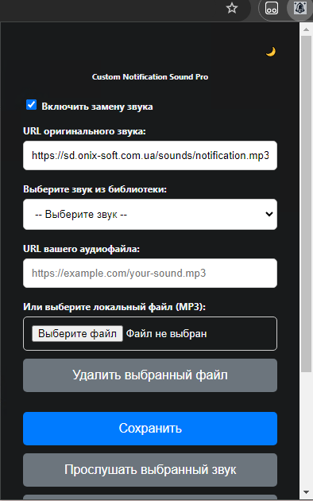
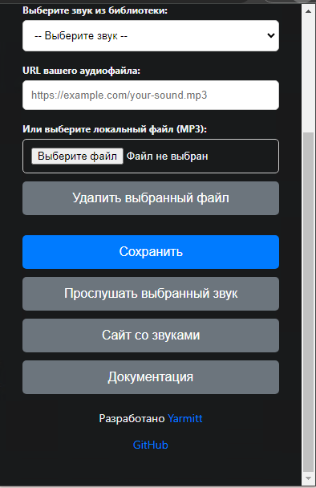

# Custom Notification Sound Pro





## Описание
**Custom Notification Sound Pro** — это расширение для Google Chrome, которое позволяет заменить стандартные звуки уведомлений на веб-сайтах на собственные аудиофайлы. Расширение поддерживает использование локальных аудиофайлов, URL-адресов звуков, а также встроенную библиотеку звуков.

## Особенности
- Замена звуков уведомлений на любом сайте.
- Поддержка локальных аудиофайлов (MP3, WAV, OGG).
- Использование URL для ваших аудиофайлов.
- Встроенная библиотека звуков.
- Тёмная и светлая темы интерфейса.
- Предпрослушивание выбранного звука перед сохранением.
- Сохранение настроек между сессиями.
- Перезагрузка страницы после сохранения настроек.

## Установка

1. Скачайте репозиторий или клонируйте его:
    ```bash
    git clone https://github.com/WoLand-Q/Custom-Notification-Sound-Pro.git
    ```

2. Откройте Google Chrome и перейдите на страницу расширений:
    ```
    chrome://extensions/
    ```

3. Включите режим разработчика, переключив тумблер в правом верхнем углу.

4. Нажмите кнопку "Загрузить распакованное расширение" и выберите папку с расширением.

## Использование

1. Откройте расширение, нажав на его иконку в панели инструментов браузера.

2. Включите замену звука, поставив галочку напротив пункта **"Включить замену звука"**.

3. Укажите URL оригинального звука, который вы хотите заменить. Это должен быть точный URL аудиофайла, используемого сайтом для воспроизведения уведомления.

4. Выберите способ замены звука:
   - **Выбрать звук из библиотеки**: выберите один из предустановленных звуков в выпадающем списке.
   - **URL вашего аудиофайла**: введите прямую ссылку на ваш аудиофайл в интернете.
   - **Выбрать локальный файл**: загрузите аудиофайл со своего компьютера.

5. Нажмите кнопку **"Сохранить"** для применения настроек.

6. Вы можете прослушать выбранный звук, нажав кнопку **"Прослушать выбранный звук"**.

7. После сохранения настроек появится уведомление об успешном сохранении, и текущая вкладка перезагрузится для применения изменений.

## Конфигурация

- **Переключение темы**: нажмите на иконку 🌞 или 🌙 в правом верхнем углу, чтобы переключаться между светлой и тёмной темами.
- **Сайт со звуками**: кнопка **"Сайт со звуками"** перенаправит вас на [MyInstants](https://www.myinstants.com/) — ресурс с разнообразными звуковыми эффектами.
- **Документация**: кнопка **"Документация"** откроет страницу с подробными инструкциями по использованию расширения.

## Нюансы и Принцип Работы

Замена звука осуществляется посредством API `declarativeNetRequest`, который перенаправляет запросы на оригинальный звук к вашему выбранному аудиофайлу.

**Важное замечание**: Точное указание URL оригинального звука является критическим. Если URL указан неверно, замена не произойдёт.

### Ограничения:
- Замена работает только для аудиофайлов, загружаемых через протоколы HTTP или HTTPS.
- Если сайт использует динамические или изменяющиеся URL для звуков, может потребоваться регулярное обновление URL оригинального звука в настройках расширения.

### Сохранение состояния:
- Расширение использует специальный флаг `isLoading`, чтобы предотвратить перезапись настроек во время загрузки.
- Настройки сохраняются в `chrome.storage.sync`, что обеспечивает их сохранение между сессиями и устройствами (при включённой синхронизации в Chrome).
- Перезагрузка страницы после сохранения настроек необходима для применения новых правил перенаправления.


